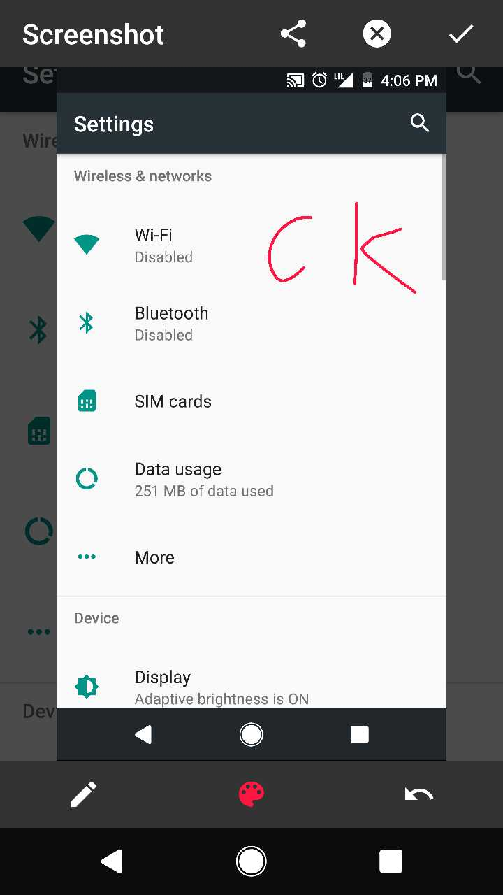

# Screenshot
A screenshot app run on Android N+(CKT Chengdu internal Project).  

## Usage
This app only works on android 7.0+.

To use the app you need to add the screenshot tile in Quick Settings panel, with the QS tile you can take screen shot quickly anytime you want:  

And the app UI would be like this:  

## Extensions
1. Share
2. Paint
3. Crop
4. Long screenshot (TBD)
